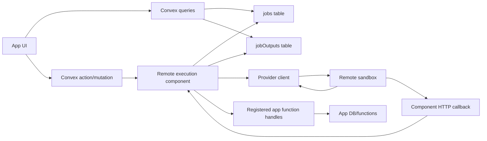

# Remote Execution System Design

## Purpose

Chef 2.0, dangerouslyShip, hosted Preflight, and similar products all need the
same missing runtime shape: Convex should be able to orchestrate durable work
that runs outside the Convex runtime, while keeping Convex as the source of
truth for state, authorization, logs, artifacts, and user-visible progress.

This component is the current package-level version of that architecture. It
lets a Convex app run commands or Node handlers in remote sandboxes through a
small provider abstraction. Daytona was the first provider. Fly Sprites is now
supported as an immediate replacement path where Daytona egress is unreliable.

The design goal is not "a Daytona component." The design goal is a Convexish
remote work primitive that can support agentic coding, previews, static
analysis, repo modification, deployment checks, and arbitrary long-running
automation.

## Product Model

These systems have different names but share one workflow.

1. A user asks Convex to do work that cannot run safely or practically inside a
   normal Convex action.
2. Convex creates a job row and returns immediately.
3. A remote sandbox receives staged code, environment, credentials, and a
   command or handler.
4. The sandbox emits output, status, and artifacts back to Convex.
5. Convex stores incremental state and exposes it through normal queries.
6. The user can watch progress, cancel work, inspect outputs, and use the final
   result.

Chef 2.0 can use this to run project-aware code generation or repo operations.
dangerouslyShip can use this to run build/test/deploy style automation against
real source trees. Hosted Preflight can use this to clone code.storage repos,
run static analysis, create previews, and write final reports.

## Current API Surface

The package exposes one main client class:

```ts
const runner = new RemoteRunner(components.remoteRunner, {
  auth: { provider: "sprites" },
});
```

The important public APIs are:

- `runCommand(ctx, options)` for one-shot shell work.
- `startCommand(ctx, options)` for durable command jobs.
- `defineAction({ handler })` for a nicer JavaScript handler that runs in Node
  inside the sandbox.
- `defineDurableAction({ handler })` for durable Node handlers.
- `defineBundledAction({ bundle })` for TypeScript modules bundled from the
  app's `convex/` directory.
- `listJobs`, `getJob`, `listJobOutput`, `cancelJob`, `cancelJobs`, and cleanup
  APIs for operational control.

The provider switch is intentionally small:

```ts
new RemoteRunner(components.remoteRunner, {
  auth: {
    provider: "sprites",
    spritesToken: process.env.SPRITES_TOKEN,
  },
});
```

Daytona remains available with `provider: "daytona"` or by omitting `provider`.

## Architecture



The component owns durable job bookkeeping. The app owns product-specific
tables, permissions, and UI. The remote sandbox owns execution. Provider
clients translate the component's internal runtime contract into the remote sandbox or
Sprites calls.

## Internal Runtime Contract

Provider clients implement the same small shape:

```ts
type SandboxClient = {
  create(params, options): Promise<SandboxRuntime>;
  get(id): Promise<SandboxRuntime>;
  delete(sandbox, timeout): Promise<void>;
};

type SandboxRuntime = {
  id: string;
  state?: string;
  target?: string;
  process: {
    executeCommand(command, cwd, env, timeout): Promise<ExecuteResult>;
    codeRun(code, params, timeout): Promise<ExecuteResult>;
  };
};
```

Everything above this layer is provider-neutral: file staging, package install,
durable job state, output capture, artifact capture, callback secrets, and
function-handle callbacks.

This is the important architectural line. Chef 2.0 and dangerouslyShip should
not know whether their work ran in a remote sandbox, Sprites, or a future Convex-owned
runner.

## Durable Jobs

Durable jobs are the default product primitive for long-running work. They are
stored in the component's `jobs` table with:

- `status`: `queued`, `running`, `succeeded`, `failed`, or `canceled`
- `sandboxId`
- timestamps and `durationMs`
- `exitCode`
- final `error`
- optional artifact metadata

Output is stored separately in `jobOutputs`, keyed by `(jobId, sequence)`. This
matters for scale: clients can poll with `afterSequence` and only fetch new
output, instead of reloading a growing string blob.

Cancellation is cooperative today. It marks jobs canceled and prevents later
completion from overwriting that state. Provider-level hard kill should be
added for Sprites sessions and Daytona sessions when using a streaming/session
execution path.

## Output And Status

The component supports two output paths:

1. Provider output captured by `executeCommand`.
2. Explicit sandbox-to-Convex callbacks through HTTP.

The robust production path should be callbacks. Provider log streaming is
useful, but product workflows should not depend entirely on a provider's
session log transport. The sandbox supervisor can emit:

- output chunks
- status updates
- checkpoints
- artifact metadata
- heartbeats
- custom product events

The component should keep the core log schema generic and allow apps to build
their own richer event/cost/trace tables on top.

## Convex Callback Bridge

Remote handlers can call back into Convex through a component-owned HTTP
endpoint. The app explicitly registers allowed function handles:

```ts
defineAction({
  functions: {
    queries: { getUser: internal.users.get },
    mutations: { saveReport: internal.reports.save },
  },
  handler: async (ctx, args) => {
    const user = await ctx.queries.getUser({ userId: args.userId });
    await ctx.mutations.saveReport({ userId: args.userId, report: "..." });
  },
});
```

This is safer than giving the sandbox arbitrary execution permission. The
sandbox only receives opaque function handles for pre-registered functions plus
a per-run secret. The component validates the secret before invoking anything.

This should remain the core security model even if Convex later provides
better first-class remote execution primitives.

## File And Source Staging

There are three staging modes.

1. Inline files: `files: [{ path, content }]`.
2. Archive seed: `seedDownloadUrl`, extracted before execution.
3. Bundled TypeScript actions: `convex-remote-runner build` bundles modules under
   `convex/remote/` and stages the generated files.

Bundled actions are a package-level workaround for a missing Convex primitive:
remote code should be able to depend on parts of the app source tree with
normal TypeScript/linting. Today the package does this with a build command and
manifest file. Long term, Convex could expose a signed deployment source bundle
or a function/module bundle artifact that remote runtimes can fetch.

## Provider Notes

### Daytona

Daytona supports rich sandbox creation options and images, but we observed
restricted-egress behavior that breaks TLS to `convex.code.storage` in some
tiers. The failure happens below Git/auth/DNS: TCP connects, the client sends
TLS ClientHello, then the connection resets.

Daytona remains useful where its network policy allows the required outbound
targets. For hosted Preflight and the current customer path, this was not
reliable enough.

### Fly Sprites

Sprites currently works for `convex.code.storage` egress. The component uses
Sprites HTTP exec without an SDK dependency. This gives an immediate replacement
for Preflight-style jobs.

Current limitations:

- Provider-specific sandbox options such as image and resources are best-effort.
- The implemented path buffers command output after exec returns.
- Sprites exposes a WebSocket exec/session API that should be used for live log
  streaming, reconnection, and hard cancellation.
- Failure diagnostics are now surfaced by probing Sprite state before/after exec
  and including status/error fields in component errors.

## Security Model

The remote sandbox should be treated as untrusted.

Principles:

- Stage only the credentials needed for that run.
- Prefer short-lived tokens and signed URLs.
- Use per-call callback secrets.
- Register explicit function handles instead of broad Convex execution access.
- Redact secrets before writing output to the component DB.
- Keep product-specific authorization in the app, not in the component.
- Avoid storing provider tokens in component tables.

For production agent workflows, the app should also own policy decisions:
which repos can be cloned, which branches can be written, which deploy targets
can be touched, and who can cancel or inspect jobs.

## Scalability

The system should scale through pagination and rescheduling, not giant rows or
single long transactions.

Already present:

- `jobOutputs` rows are sequence-indexed.
- `listJobs` is paginated.
- `listJobOutput` supports `afterSequence`.
- cleanup is batched and resumable.
- cancellation can be batched.

Needed next:

- store provider session IDs on jobs for reconnect/kill
- heartbeat timestamps separate from output timestamps
- provider-level cancellation
- resumable output streaming from Sprites WebSocket sessions
- bounded output chunk sizes
- optional app-owned event tables for richer product telemetry

## What Chef 2.0 And dangerouslyShip Should Build On

They should treat the component as a low-level remote work substrate and define
their own product-level records.

Suggested product-level tables:

- `runs`: user intent, repo, branch, status, permissions, final result
- `steps`: semantic phases such as clone, analyze, install, test, deploy
- `events`: product events, possibly linked to component output sequences
- `artifacts`: reports, diffs, logs, screenshots, deploy URLs
- `approvals`: human approval gates for dangerous operations

The component job ID should be a foreign key, not the main product object. This
keeps the reusable runtime small and lets each product express its own UX.

## What Convex Should Add

These are not Daytona or Sprites features. They are composable Convex
primitives that would make this class of system feel native.

### 1. Deployment Source Bundle Primitive

Expose a signed, scoped artifact for the current deployment's source/modules so
a remote runtime can fetch the same code Convex deployed. This would replace
package-specific build hacks.

Properties:

- generated by Convex deploy/dev
- short-lived signed URL
- can include selected modules only
- source map / manifest for TypeScript resolution
- no secrets

### 2. Remote Function Handle Capabilities

Make it easy to mint scoped function-handle capability bundles:

```ts
const capability = await ctx.mintFunctionCapability({
  queries: { getUser: internal.users.get },
  mutations: { saveReport: internal.reports.save },
  ttlMs: 60 * 60 * 1000,
});
```

The remote runtime should call Convex with the capability, not with broad admin
credentials.

### 3. Component-Owned Callback Endpoints

Components should be able to expose stable, self-mounted HTTP endpoints without
the app manually wiring every route. This package already leans on
`httpPrefix`; Convex could make the pattern more explicit and ergonomic.

### 4. Durable External Process Primitive

Convex could provide a generic durable external process contract:

- job row
- output stream
- heartbeat
- cancellation
- retry/reconnect
- artifact references

Providers such as Daytona, Sprites, Modal, Fly Machines, or a Convex-owned
runner could plug into that contract.

### 5. Typed Remote Context

TypeScript should know what is available inside the remote handler:

- `ctx.exec`
- `ctx.fs`
- allowed function handles
- staged environment
- bundled helper modules

The current package approximates this with `defineRemoteHandler` and generated
bundles. A Convex primitive could make the development experience first-class.

## Open Questions

- How long should the old Daytona compatibility aliases remain?
- Should Sprites become the default provider for Preflight-like workflows?
- Should live output use provider WebSockets, sandbox-side HTTP callbacks, or
  both?
- How should artifact upload work when the app wants storage IDs in its own
  namespace?
- How much source-tree access should remote handlers get by default?
- What is the minimum provider contract for a future `@convex-dev/remote-runner`
  package?

## Recommended Next Steps

1. Add Sprites WebSocket sessions for live output, reconnect, and hard kill.
2. Store provider metadata on jobs: provider, session ID, sandbox ID, and last
   heartbeat.
3. Add first-class status callbacks alongside output callbacks.
4. Build Chef 2.0 and dangerouslyShip on product-level run tables that reference
   component jobs.
5. Propose Convex primitives for deployment source bundles and scoped function
   capabilities.
